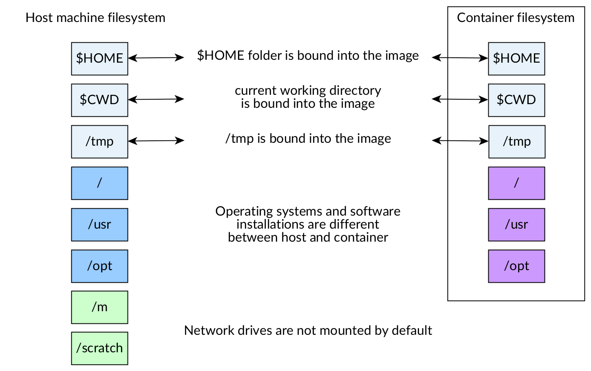
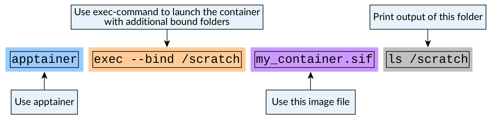

Advanced settings for running containers
========================================

.. objectives::

   * Learn more advanced flags for running containers

Binding folders into your container
-----------------------------------

When you launch a program in a container, the program runs in a contained
environment. The file system in the container might not have the same
folders structure as the machine that runs the container.

So, when you want to work on your data, you need to bring it with you into
this contained world inside the container.

This is done via method called **mount binding**.

Binding means that a folder from the host system is mapped into a folder
inside the container.

   Figure 1: Only some folders are mounted by default

By default, ``$HOME``, ``$CWD`` (current working directory)
``/tmp`` and
`few other paths <https://apptainer.org/docs/user/main/bind_paths_and_mounts.html#system-defined-bind-paths>`__
are bound to the image.

If you want to do additional mappings you need to do it by giving an
extra arguments to the command you're running.

The following would bind folder ``/scratch`` from the host system to
``/scratch`` in the container:

.. code-block:: console

   $ apptainer exec --bind /scratch example.sif ls /scratch

   Figure 2: Binding a directory inside a container

Setting ``--bind``-argument works for ``apptainer run``- and
``apptainer shell``-commands as well.

You can also bind directories to different places. This is especially
helpful if, for example. the code in container expects that data
should be in ``/data``:

.. code-block:: console

   $ apptainer exec --bind /scratch:/data example.sif ls /data

.. warning::

   Bind mounts **are the same folders inside and outside** of the image.

   Deleting file from the folder that you bound inside the image will
   delete the file completely.

Running containers that use GPUs
--------------------------------

If your program uses GPUs, you'll need to make the GPUs visible in
the container. This is done by giving additional flag to the
apptainer command.

Using NVIDIA's GPUs
*******************

When using NVIDIA's GPUs that use the CUDA-framework the flag is ``--nv``.

As an example, let's get a CUDA-enabled PyTorch-image:

.. code-block:: console

   $ apptainer pull pytorch-cuda.sif docker://docker.io/pytorch/pytorch:2.2.2-cuda12.1-cudnn8-runtime

Now when we launch the image, we can give the image GPU access with

.. code-block:: console

   $ apptainer exec --nv pytorch-cuda.sif python -c 'import torch; print(torch.cuda.is_available())'

.. figure:: img/nv_example.png

   Figure 3: Enabling NVIDIA's GPUs in containers

.. admonition:: Expected result
   :class: dropdown

   If you run this in a system with an NVIDIA GPU, you should see the following result:

   .. code-block:: console

      $ apptainer exec --nv pytorch-cuda.sif python -c 'import torch; print(torch.cuda.is_available())'
      True

Using AMD's GPUs
****************

When using AMD's GPUs that use the ROCm-framework the flag is ``--rocm``.

As an example, let's get a ROCm-enabled PyTorch-image:

.. code-block:: console

   $ apptainer pull pytorch-rocm.sif docker://docker.io/rocm/pytorch:rocm6.1_ubuntu22.04_py3.10_pytorch_2.1.2

.. figure:: img/rocm_example.png

   Figure 4: Enabling AMD's GPUs in containers

Now when we launch the image, we can give the image GPU access with

.. code-block:: console

   $ apptainer exec --rocm pytorch-rocm.sif python -c 'import torch; print(torch.cuda.is_available())'

.. admonition:: Expected result
   :class: dropdown

   If you run this in a system with an AMD GPU, you should see the following result:

   .. code-block:: console

      $ apptainer exec --rocm pytorch-rocm.sif python -c 'import torch; print(torch.cuda.is_available())'
      True

