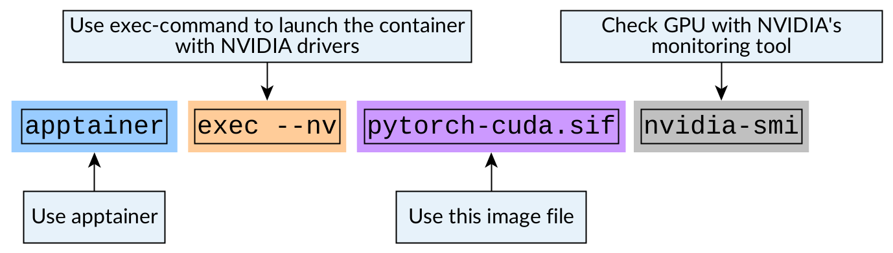
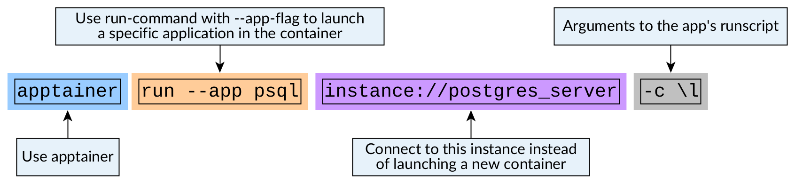

Advanced settings for running containers
========================================

.. objectives::

   * Learn more advanced flags for running containers

Binding folders into your container
-----------------------------------

When you launch a program in a container, the program runs in a contained
environment. The file system in the container might not have the same
folders structure as the machine that runs the container.

So, when you want to work on your data, you need to bring it with you into
this contained world inside the container.

This is done via method called **mount binding**.

Binding means that a folder from the host system is mapped into a folder
inside the container.

   Figure 1: Only some folders are mounted by default

By default, ``$HOME``, ``$CWD`` (current working directory)
``/tmp`` and
`few other paths <https://apptainer.org/docs/user/main/bind_paths_and_mounts.html#system-defined-bind-paths>`__
are bound to the image.

If you want to do additional mappings you need to do it by giving an
extra arguments to the command you're running.

The following would bind folder ``/scratch`` from the host system to
``/scratch`` in the container:

.. code-block:: console

   $ apptainer exec --bind /scratch example.sif ls /scratch

   Figure 2: Binding a directory inside a container

Setting ``--bind``-argument works for ``apptainer run``- and
``apptainer shell``-commands as well.

You can also bind directories to different places. This is especially
helpful if, for example. the code in container expects that data
should be in ``/data``:

.. code-block:: console

   $ apptainer exec --bind /scratch:/data example.sif ls /data

.. warning::

   Bind mounts **are the same folders inside and outside** of the image.

   Deleting file from the folder that you bound inside the image will
   delete the file completely.

.. admonition:: Key points to remember

   - By default only some folders are bound inside the container.
   - You'll need to manually ``--bind``-folders from outside of
     the container if you want to use them inside the container.
   - Bound folders are the same folders inside and outside of the
     container.

Running containers that use GPUs
--------------------------------

If your program uses GPUs, you'll need to make the GPUs visible in
the container. This is done by giving additional flag to the
apptainer command.

The container itself must have the correct GPU computing libraries
installed inside the image (CUDA toolkit for NVIDIA and ROCm for AMD).
Code inside the image needs to be installed with GPU support as well.
Apptainer will only mount the driver libraries and the GPU devices
that these toolkits need to run the code on GPUs.

Using NVIDIA's GPUs
*******************

When using NVIDIA's GPUs that use the CUDA-framework the flag is ``--nv``.

As an example, let's get a CUDA-enabled PyTorch-image:

.. code-block:: console

   $ apptainer pull pytorch-cuda.sif docker://docker.io/pytorch/pytorch:2.2.2-cuda12.1-cudnn8-runtime

Now when we launch the image, we can give the image GPU access with

.. code-block:: console

   $ apptainer exec --nv pytorch-cuda.sif python -c 'import torch; print(torch.cuda.is_available())'

   Figure 3: Enabling NVIDIA's GPUs in containers

.. admonition:: Expected result
   :class: dropdown

   If you run this in a system with an NVIDIA GPU, you should see the following result:

   .. code-block:: console

      $ apptainer exec --nv pytorch-cuda.sif python -c 'import torch; print(torch.cuda.is_available())'
      True

.. admonition:: Key points to remember

   - Code inside the container image needs to support GPU calculations.
   - Container image should have a working CUDA toolkit installed.
   - Use ``--nv``-flag to mount the device drivers inside of the image.

Using AMD's GPUs
****************

When using AMD's GPUs that use the ROCm-framework the flag is ``--rocm``.

As an example, let's get a ROCm-enabled PyTorch-image:

.. code-block:: console

   $ apptainer pull pytorch-rocm.sif docker://docker.io/rocm/pytorch:rocm6.1_ubuntu22.04_py3.10_pytorch_2.1.2

.. figure:: img/rocm_example.png

   Figure 4: Enabling AMD's GPUs in containers

Now when we launch the image, we can give the image GPU access with

.. code-block:: console

   $ apptainer exec --rocm pytorch-rocm.sif python -c 'import torch; print(torch.cuda.is_available())'

.. admonition:: Expected result
   :class: dropdown

   If you run this in a system with an AMD GPU, you should see the following result:

   .. code-block:: console

      $ apptainer exec --rocm pytorch-rocm.sif python -c 'import torch; print(torch.cuda.is_available())'
      True

.. admonition:: Key points to remember

   - Code inside the container image needs to support GPU calculations.
   - Container image should have a working ROCm toolkit installed.
   - Use ``--rocm``-flag to mount the device drivers inside of the image.

Creating services that run on the background and specifying multiple apps in a container
----------------------------------------------------------------------------------------

You can use Apptainer to launch temporary services.
Service might be, for example, a database application
that your code uses to fetch subsets from a
larger dataset.

Creating containers for these kinds of services can
often be quite complicated as they might need specific
folders to be created or specific environment variables
to be set.

The following example uses a
`PostgreSQL image <https://hub.docker.com/_/postgres/>`__ to
set up a PostgreSQL database. Setting up this service requires
few mounts and environment variables to be set and these have
been found by looking at the
`docker-entrypoint.sh <https://github.com/docker-library/postgres/blob/master/docker-entrypoint.sh>`__-script
that would start the image when using Docker.

When we're launching a complicated service such as this
we might also want to specify new ways of interacting
this container. In the case of PostgreSQL, we'll most likely
want to use the PostgreSQL client to modify our databases.
We can do this by specifying multiple apps.

Let's look at the definition file:

.. code-block:: singularity

   Bootstrap: docker
   From: postgres:16

   %environment
       export LC_ALL=C
       export LANG=C
       export LANGUAGE=C

   %startscript
       export POSTGRES_USER=$PGUSER
       export POSTGRES_PASSWORD=$PGPASSWORD
       export PGHOST=$HOSTNAME
       export PGPORT=${PGPORT:-19200}

       # Run the entry script for PostgreSQL Docker image
       exec docker-entrypoint.sh postgres "$@"

   %help

       This is a postgres container.

       The following data locations need to be mounted into the container:

       - Data location for the postgres: /var/lib/postgresql/data
       - Location for the runfiles for postgres: /var/run/postgresql

       The start script needs the following arguments:

       - postgres user name
       - postgres user password

       Usage:

           mkdir postgres_data
           mkdir postgres_run

           export PGUSER=postgres_user
           export PGPASSWORD=postgres_password
           apptainer instance start --bind postgres_data:/var/lib/postgresql/data --bind postgres_run:/var/run/postgresql postgres_container.sif postgres_server

           apptainer instance list

   %apprun psql
       export POSTGRES_USER=$PGUSER
       export POSTGRES_PASSWORD=$PGPASSWORD
       export PGHOST=$HOSTNAME
       export PGPORT=${PGPORT:-19200}
       exec psql "$@"

   %apphelp psql
       Run psql-client in image

       PostgreSQL instance needs to be started beforehand

       Usage:

           export PGUSER=postgres_user
           export PGPASSWORD=postgres_password
           apptainer run --app psql instance://postgres_server -c 'create database test;'
           apptainer run --app psql instance://postgres_server -c '\l'

The definition file has couple of new blocks:

- ``%startscript``: This block defines what commands will be run when we start up the service.
- ``%apprun``: This block allows us to specify individual applications in our image. In this
  case we have an application called ``psql`` for the PostgreSQL client. This block specifies
  how we run this specific application.
- ``%apphelp``: Each app in a container can have it's own help section as well as other
  setup sections. See documentation for all possibilities.

For more information on how to specify multiple apps in a container, see
`this documentation page <https://apptainer.org/docs/user/latest/definition_files.html#scif-app-sections>`__.

After building the image we can start the database with:

.. code-block:: console

   $ mkdir postgres_data
   $ mkdir postgres_run
   $ export POSTGRES_USER=postgres_user
   $ export POSTGRES_PASSWORD=postgres_password
   $ apptainer instance start --bind postgres_data:/var/lib/postgresql/data --bind postgres_run:/var/run/postgresql postgres_container.sif postgres_server

.. figure:: img/instance_example.png

   Figure 5: Starting container as an instance

Now that we have started the instance we can check that the instance is running with:

.. code-block:: console

   $ apptainer instance list

Let's use the ``psql``-app that we have specified. We can use it to make a
connection to the server and to create a new database. Let's also list the
newly created database:

.. code-block:: console

   $ export PGUSER=postgres_user
   $ export PGPASSWORD=postgres_password
   $ apptainer run --app psql instance://postgres_server -c 'create database test;'
   $ apptainer run --app psql instance://postgres_server -c '\l'

   Figure 6: Running an app from a container

You'll notice that we did not start a new container. Instead ran the application in
the running instance by specifying ``instance://postgres_server`` instead of the
``.sif``-image. You'll also note that we did not need to specify the bind-mounts
again: once the instance is started, bind mounts are made and they are there until
the instance is stopped.

We can then shut down the server with:

.. code-block:: console

   $ apptainer instance stop postgres_server

.. admonition:: Key points to remember

   - You can start containers as instances.
   - You can use ``%startscript``-block to specify how an instance should start.
   - You can create multiple apps in a container with ``%app*``-blocks
   - Started instances with bind mounts have them until instance is stopped.
     This is very useful if you plan on running multiple commands against a
     single container.
