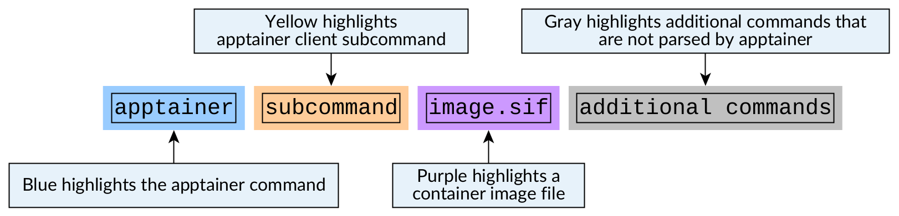
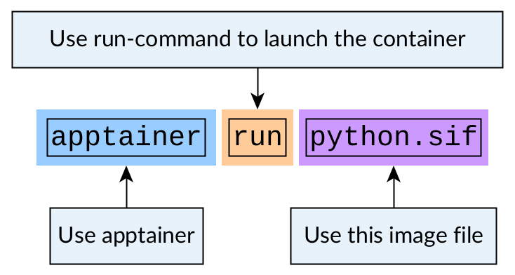
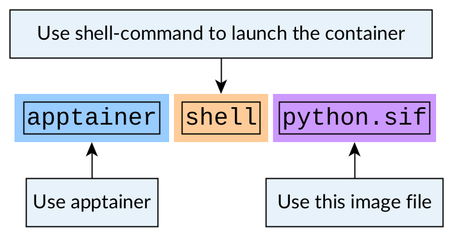
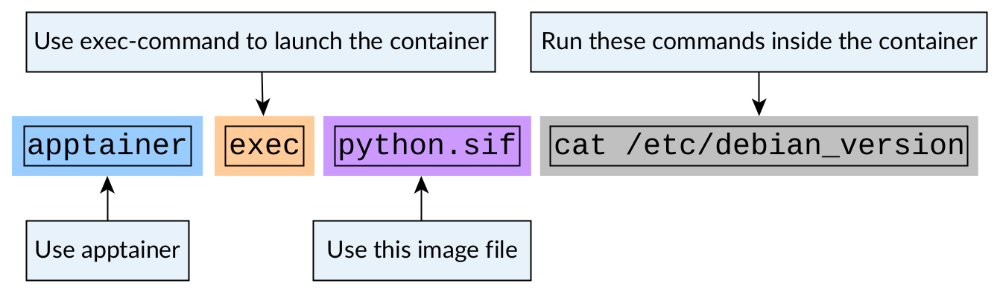

Basics of running containers
============================

.. objectives::

   * Learn what methods are available to run a container

Different ways you can run your containers
------------------------------------------

You can run your container in multiple different ways:

- You can run the container as a single application
- You can get an interactive terminal in the container
- You can run an application from within the container

We'll cover these ways in individual sections below.

How to read Apptainer commands?
-------------------------------

Apptainer's commands can sometimes have multiple flags
which can make it hard to parse the command line.

A typical apptainer command has:

1. ``apptainer`` is at the start because we use the
   Apptainer client to run the commands.
2. A subcommand (like ``pull``, ``build``, ``exec``, ``run`` etc.)
   that tells which Apptainer feature we want to use.
3. Often after the subcommand we have the name of the image we
   want to use.
4. At the end we might have additional commands that Apptainer
   ignores but are to be digested by the application that the container itself is running.

For legibility reasons many commands in this lesson are highlighted
in this format:

   Figure 1: How apptainer-commands are highlighted

For the comprehensive list of client commands, see
`Apptainer CLI reference page <https://apptainer.org/docs/user/latest/cli.html>`__.

Obtaining a container from container registry
---------------------------------------------

For these examples let's use a
`Python image from Docker Hub <https://hub.docker.com/_/python>`__.

For now let's just consider it as an application we want
to use and that this application is available in Docker Hub.

Let's create the container image with the following command:

.. code-block:: console

   $ apptainer pull python.sif docker://python

We'll talk about container images and image building later on.
For now it is enough to know that the file ``python.sif`` contains
a Python installation.

Running the container
---------------------

Running the container means that we run some specific program
that the image creator has set to be the default program for this image.

When we run the container we will execute a so-called entry script
or runscript that contains commands specified by the image creators.

.. warning::

   Remember to only run containers from sources that you trust.

Let's run the Python container image:

.. code-block:: console

   $ apptainer run python.sif

.. admonition:: Expected result
   :class: dropdown

   We get a Python interpreter running in the container:

   .. code-block:: console

      $ apptainer run python.sif
      Python 3.12.3 (main, Apr 10 2024, 14:35:18) [GCC 12.2.0] on linux
      Type "help", "copyright", "credits" or "license" for more information.
      >>>

You should read the command line like this:

   Figure 2: A simple run command

This syntax might seem self-evident, but in more complex use cases we will give
additional flags to various parts of the command.

Launching an interactive shell in the container
-----------------------------------------------

We can launch an interactive shell in a container with
``apptainer shell``-command:

.. code-block:: console

   $ apptainer shell python.sif

.. admonition:: Expected result
   :class: dropdown

   We get a ``bash`` terminal running in the container:

   .. code-block:: console

      $ apptainer shell python.sif
      Apptainer> echo $SHELL
      /bin/bash

You should read the command line like this:

   Figure 3: Launch a shell in a container

Running a single program from the container
-------------------------------------------

We can launch a single program in a container with
``apptainer exec``-command.

The Python container is based on a Debian Linux distribution.
Let's check the Debian version in the container:

.. code-block:: console

   $ apptainer exec python.sif cat /etc/debian_version

.. admonition:: Expected result
   :class: dropdown

   With the command we print the contents of the
   ``/etc/debian_version``-file:

   .. code-block:: console

      $ apptainer exec python.sif cat /etc/debian_version
      12.5

You should read the command line like this:

   Figure 4: Launch a program in a container

Review of this session
----------------------

.. admonition:: Key points to remember

   - You can run the containers default program/application/set-of-commands with ``apptainer run my_image.sif``
   - You can start an interactive shell in a container with ``apptainer shell my_image.sif``
   - You can execute a single program in a container with ``apptainer exec my_image.sif my_program arg1 arg2``
