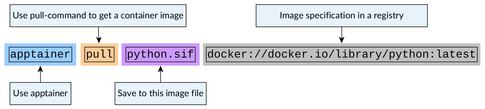
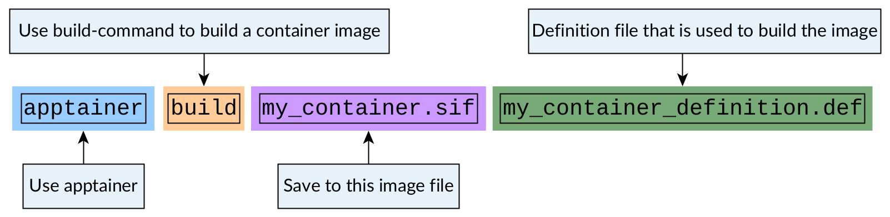

Building Apptainer images
=========================

.. objectives::

   - Learn how you can build container images

In this session we'll discuss various ways you can create Apptainer images.

Pulling an existing image from a container registry
---------------------------------------------------

We have already seen how to pull a
`Python image from Docker Hub <https://hub.docker.com/_/python>`__.

.. code-block:: console

   $ apptainer pull python.sif docker://python

We could have alternatively used the full registry specification URL:

.. code-block:: console

   $ apptainer pull python.sif docker://docker.io/library/python:latest

The format for these registry specifications is:

``docker://REGISTRY_URL/USER_NAMESPACE/IMAGE_NAME:IMAGE_TAG``

Here ``docker://`` means that we use a Docker Hub compatible container
registry. There are other compatible registries such as
`quay <https://quay.io/>`__ and
`GitHub container registry <https://docs.github.com/en/packages/working-with-a-github-packages-registry/working-with-the-container-registry>`__.

You can read the command like this:

   Figure 1: Pulling an image from a repository

Handling temporary layers needed by the build process
-----------------------------------------------------

When Apptainer creates a ``.sif``-image it needs to first download any layers
it uses for the building. Then it will squash all of these layers to one
``.sif``-image.

These are stored in a folder specified by an environment variable
``APPTAINER_CACHEDIR``. By default, Apptainer will use
``$HOME/.apptainer/cache``. This can result in you running out of quota
during the image creation process if the home folder quota is not big.

You can set the cache directory with:

.. code-block:: console

   $ mkdir apptainer_cache
   $ export APPTAINER_CACHEDIR=$PWD/apptainer_cache

It is adviced to move it to some filesystem that has enough space available.

You can check the cache status with:

.. code-block:: console

   $ apptainer cache list

and you can clean the cache with:

.. code-block:: console

   $ apptainer cache clean

See `this page <https://apptainer.org/docs/user/main/build_env.html#sec-cache>`__
for more documentation.

Creating an image using a specification file
--------------------------------------------

Let's say we want to create an apptainer image for the following
``summation.py``-script:

.. code-block:: python

   import argparse

   parser = argparse.ArgumentParser()
   parser.add_argument(
       "numbers", help="Numbers to sum", type=int, nargs='*'
   )
   args = parser.parse_args()

   numbers = args.numbers

   if len(numbers) > 1:
      print(f'Sum of numbers was: {sum(numbers)}')
   else:
      print('You did not give me any numbers to sum!')

Let's create a definition file for this image:

.. code-block:: singularity

   Bootstrap: docker
   From: python:latest

   %files
       summation.py /opt

   %runscript
       echo "Got arguments: $*"
       exec python /opt/summation.py "$@"

In this definition file we specify:

1. The bootstrapping method we want to use to build the image.
2. The base image we want to use for bootstrapping.
3. Files we want to copy to the image in the ``%files``-block.
4. Commands we want to run when the image is ran in the ``%runscript``-block.

Now we can built this image with:

.. code-block:: console

   $ apptainer build my_container.sif my_container_definition.def

   Figure 2: Building an image from a definition file

After building the image we can test out the image with:

.. code-block:: console

   $ apptainer run my_container.sif 1 2

.. admonition:: Expected result
   :class: dropdown

   Building container should result in a container image
   ``my_container.sif`` being created.

   Running the container should produce the following output:

   .. code-block:: console

      $ apptainer run my_container.sif 1 2
      Got arguments: 1 2
      Sum of numbers was: 3

.. admonition:: Key points to remember

   - Bootstrap settings are analogous to what you would use with
     ``apptainer pull``.
   - The application inside the container could be much more complex.
     By creating a ``apptainer run``-interface via ``%runscript``-block
     you can convert a big and complex installation into what is
     basically a single executable.

Running additional installation commands during image creation
--------------------------------------------------------------

More often than not creating an image involves more than
just using an existing image.

If you want to run additional installation commands,
you can do them in a ``%post``-block. These commands will
be run once during the building procedure.

For example, let's modify our definition file so that we get an installation
of `numpy <https://numpy.org/>`__-package in the image:

.. code-block:: singularity

   Bootstrap: docker
   From: python:latest

   %files
       summation.py /opt

   %runscript
       echo "Got arguments: $*"
       exec python /opt/summation.py "$@"

   %post
       pip install numpy

After re-building the image we can test the numpy installation with:

.. code-block:: console

   $ apptainer exec my_container.sif python -c 'import numpy; print(numpy.__version__)'

.. admonition:: Expected result
   :class: dropdown

   During the build process we should see that the numpy-package is
   being installed.

   Running the container should produce the following output:

   .. code-block:: console

      $ apptainer exec my_container.sif python -c 'import numpy; print(numpy.__version__)'
      1.26.4

.. admonition:: Image building is done as a fake root-user

   Commands that are run in the ``%post`` step and in other setup steps
   are run in a state called
   `fakeroot <https://apptainer.org/docs/user/main/fakeroot.html>`__ where
   the user looks like the ``root``-user inside the container when in reality
   the user is a normal user.

   This means that use of ``sudo`` is not needed when installing packages via
   package managers.

   When converting installation instructions written for normal
   non-containerized installations to definition files 
   one should usually remove ``sudo`` from the front of commands.

Setting environment variables in the image
------------------------------------------

We can also specify that additional environment variables should be set
when the image is being launched with an ``%environment``-block.

While ``%runscript`` only applies when we ``apptainer run`` the image,
commands specified in the ``%environment``-block will be executed when
the image is launched.

.. code-block:: singularity

   Bootstrap: docker
   From: python:latest

   %files
       summation.py /opt

   %runscript
       echo "Got arguments: $*"
       exec python /opt/summation.py "$@"

   %post
       pip install numpy

   %environment
       export MYVAR=yes

After re-building the image we can test that the environment values is set with:

.. code-block:: console

   $ apptainer exec my_container.sif python -c 'import os; print(os.getenv("MYVAR"))'

.. admonition:: Expected result
   :class: dropdown

   After rebuilding the container running the container should produce the following output:

   .. code-block:: console

      $ apptainer exec my_container.sif python -c 'import os; print(os.getenv("MYVAR"))'
      yes

Adding documentation to your image
----------------------------------

If you're planning on sharing your image with other people or you want to
keep tabs on multiple images you can use labels to mark your image with
a ``%labels``-block.

You can also add a ``%help``-block that will tell users on how to use your
image.

Let's add these blocks to the definition file:

.. code-block:: singularity

   Bootstrap: docker
   From: python:latest

   %files
       summation.py /opt

   %runscript
       echo "Got arguments: $*"
       exec python /opt/summation.py "$@"

   %post
       pip install numpy

   %environment
       export MYVAR=yes

   %labels
      Author: CodeRefinery
      Version: v0.0.1
      Description: This is an example image

   %help
      This container sums up numbers.

      Example:

         apptainer run my_container.sif 1 2

Let's check the help message with:

.. code-block:: console

   $ apptainer run-help my_container.sif

.. admonition:: Expected result
   :class: dropdown

   The output should look something like this:

   .. code-block:: console

      $ apptainer run-help my_container.sif
          This container sums up numbers.

          Example:

             apptainer run my_container.sif 1 2

Examining the container
-----------------------

Now that we have a container with some software in it we can examine it with

.. code-block:: console

   $ apptainer inspect my_container.sif

.. admonition:: Expected result
   :class: dropdown

   The output should look something like this:

   .. code-block:: console

      $ apptainer inspect my_container.sif
      Author:: CodeRefinery
      Description:: This is an example image
      Version:: v0.0.1
      org.label-schema.build-arch: amd64
      org.label-schema.build-date: Thursday_25_April_2024_21:45:51_EEST
      org.label-schema.schema-version: 1.0
      org.label-schema.usage.apptainer.version: 1.3.0
      org.label-schema.usage.singularity.deffile.bootstrap: docker
      org.label-schema.usage.singularity.deffile.from: python:latest

We can also see the image contents with

.. code-block:: console

   $ apptainer sif list my_container.sif

.. admonition:: Expected result
   :class: dropdown

   Output of the command should be something like this:

   .. code-block:: console

      $ apptainer sif list my_container.sif
      ------------------------------------------------------------------------------
      ID   |GROUP   |LINK    |SIF POSITION (start-end)  |TYPE
      ------------------------------------------------------------------------------
      1    |1       |NONE    |32176-32385               |Def.FILE
      2    |1       |NONE    |32385-34957               |JSON.Generic
      3    |1       |NONE    |34957-35407               |JSON.Generic
      4    |1       |NONE    |36864-394522624           |FS (Squashfs/-System/amd64)

From the output of the previous command we see that at position 1 of the file we have
the definition file used to build the image. We can examine that with

.. code-block:: console

   $ apptainer sif dump 1 my_container.sif

Additional definition file options
----------------------------------

There are plenty of other sections that can be used in the definition
file. For a great and comprehensive documentation, see
`Apptainer's documentation for definition files <https://apptainer.org/docs/user/main/definition_files.html>`__.

These features include:
   - Creating multiple callable applications in the image
   - Creating services that can be started and stopped
   - Creating tests for the image build

.. admonition:: Key points to remember

   - Use ``apptainer pull`` to pull existing Docker images.
   - Use ``apptainer build`` to build custom images from definition files.
   - There are plenty of additional features provided. Check documentation
     for more info.
