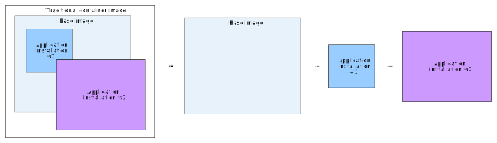
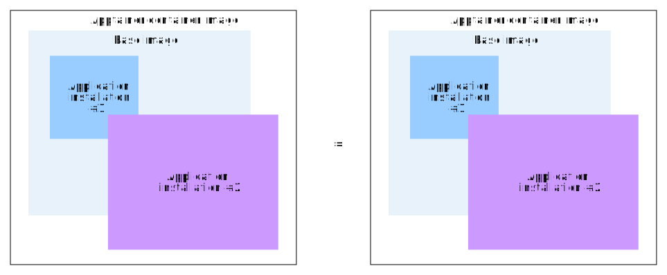
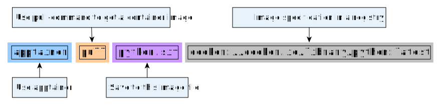

Container images
================

.. objectives::

   * Learn what container image means
   * Learn to create container images

What is a container image?
--------------------------

Traditional container images (docker etc.)
******************************************

When containers launch they need a file system with a linux operating system.
This filesystem is provided by a **container image**.

This naming comes from an analogy with a traditional image or a painting.

.. figure:: https://upload.wikimedia.org/wikipedia/commons/6/6d/Saint_Jerome_Leonardo_-_image_only_%28Q972196%29.jpg
   :width: 60%

   Figure 1: Saint Jerome in the Wilderness by Leonardo da Vinci

Let's consider the image above. It is an unfinished painting by Leonardo da Vinci.

From the unfinished nature of this painting you can see the following:

- Some areas of the background panel are not touched at all (e.g. hands).
- The base background is in some places covered by sketches (e.g the lion) and in most places by the background colors.
- The background colors are sometimes covered in sketches as well (e.g. top left).

From these things we can gather that the image is constructed from **layers** where
paint or sketches **cover what is hidden underneath**.

This analogy happens with traditional container images as well (e.g. docker images):
**container images consist of multiple layers where top layers can hide preceding layers**.

A typical image might look something like this:

   Figure 2: Typical container image consists of individual layers

In practice this overwriting behaviour is done by using a file format called SquashFS,
where file systems are stored in one single layer.

In a traditional image the image is built in this fashion:

1. The build starts from a base image. This is often an OS image, but it does not have to
   be. It can be some other image that has a OS image as its base image.
2. This layer is started up in a container.
3. Modifications are done. For example, an application is installed.
4. The **difference of what files were modified is stored into a new layer**.
5. This new image with the modifications is now used as a base image.
6. More modifications are done unless there are no more modifications to do.
7. The last layer is **tagged** with some human readable name.
8. When image is published to other users, it is sent to some container registry.

The file that contains the commands that need to be run to build the image
is called a `Dockerfile <https://docs.docker.com/reference/dockerfile/>`__.
This is true for systems other that Docker as well.

This way of working with **differences of layers** reduces the space needed to
store the images and the network capacity needed to transfer the images.

When a container is launched these layers are fetched and organized on top of each
other and when a program tries to find a file, it will go through the layers until it
finds it. This is analogous to light bouncing off from the top layer of paint on a
painting.

.. admonition:: Key points to remember

   - Traditional containers are built layer by layer
   - Traditional containers are built from Dockerfiles

Apptainer container images
**************************

Apptainer works a bit differently than traditional container setups.

Apptainer stores the container image in one file in
**Singularity image format** or **.sif**. This file is a SquashFS file with
additional metadata included.

This means that **Apptainer does not store image as multiple layers**.
Instead it writes all of the layers into one single layer. This is analogous
to printing an image of a painting on a piece of paper. The hidden layers
of paint are not replicated and only the topmost layer is visible.

   Figure 2: Apptainer container image is a single unchanging image layer

This way of working has some upsides and some downsides.

Upsides include:

- The image is more portable. One image can be easily transferred across
  systems using normal file copying tools.
- The image is more reproducible. The metadata stored in the file gives
  information on when the image was created and what commands were used
  to create it.
- The image is easier to archive. One just needs to keep track of a single
  file.

Downsides include:

- Image creation takes longer as all operations need to be done in one go.
  Traditional container images can be built layer by layer.
- Images cannot be stored in traditional registries like Docker Hub.

Apptainer images can use Docker images as their starting point.
Additional build steps and runtime behaviour can be specified in a
`definition file (.def) <https://apptainer.org/docs/user/latest/definition_files.html>`__.

.. admonition:: Key points to remember

   - Apptainer images are a single image layer which is stored in a .sif-file.
   - When built from traditional image, Apptainer images squash all layers to a single one.
   - Apptainer images are built from definition file (.def)

Building images
---------------

Pulling an existing image from a container registry
***************************************************

We have already seen how to pull a
`Python image from Docker Hub <https://hub.docker.com/_/python>`__.

.. code-block:: console

   $ mkdir apptainer_cache
   $ export APPTAINER_CACHEDIR=$PWD/apptainer_cache
   $ apptainer pull python.sif docker://python

We could have alternatively used the full registry specification URL:

.. code-block:: console

   $ apptainer pull python.sif docker://docker.io/library/python:latest

The format for these registry specifications is:

``docker://REGISTRY_URL/USER_NAMESPACE/IMAGE_NAME:IMAGE_TAG``

You can read the command like this:

   Figure 3: Pulling an image from a repository

Handling temporary layers needed for build process
**************************************************

When Apptainer creates a ``.sif``-image it needs to first download any layers
it uses for the building. Then it will squash all of these layers to one
``.sif``-image.

These are stored in a folder specified by an environment variable
``APPTAINER_CACHEDIR``. By default, apptainer will use
``$HOME/.apptainer/cache``. This can result in you running out of quota
during the image creation process if the home folder quota is not big.

It is adviced to move it to some filesystem that has enough space available.

You can check the cache status with:

.. code-block:: console

   $ apptainer cache list

and you can clean the cache with:

.. code-block:: console

   $ apptainer cache clean

See `this page <https://apptainer.org/docs/user/main/build_env.html#sec-cache>`__
for more documentation.

Creating an image using a specification file
********************************************

Let's say we want to create an apptainer image for the following
``hello-world.py``-script:

.. code-block:: python

   print("Hello world!")

Let's create a definition file for this image:

.. code-block:: apptainer

   Bootstrap: docker
   From: python:latest

   %files
       hello-world.py /opt

   %runscript
       python hello-world.py

In this definition file we specify:

1. The bootstrapping method we want to use to build the image.
2. The base image we want to use for bootstrapping.
3. Files we want to copy to the image in the ``%files``-block.
4. Commands we want to run when the image is ran in the ``%runscript``-block.

Now we can built this image with:

.. code-block:: console

   $ apptainer build hello-world.sif hello-world.def

After building the image we can test out the image with:

.. code-block:: console

   $ apptainer run hello-world.sif

.. admonition:: Expected result
   :class: dropdown

   Building a container should result in a container image
   ``hello-world.sif`` being created.

   Running the container should produce the following result.

   .. code-block:: console

      $ apptainer run hello-world.sif
      Hello world!

Image sources
-------------

- Leonardo da Vinci, `CC0 <https://creativecommons.org/publicdomain/zero/1.0/>`__, via `Wikimedia Commons <https://commons.wikimedia.org/wiki/File:Saint_Jerome_Leonardo_-_image_only_(Q972196).jpg>`__

