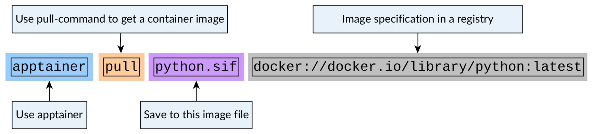
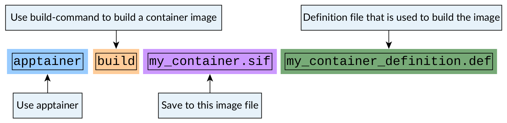

Container images
================

.. objectives::

   * Learn what container image means
   * Learn to create container images

What is a container image?
--------------------------

Traditional container images (docker etc.)
******************************************

When containers launch they need a file system with a linux operating system.
This filesystem is provided by a **container image**.

This naming comes from an analogy with a traditional image or a painting.

.. figure:: https://upload.wikimedia.org/wikipedia/commons/6/6d/Saint_Jerome_Leonardo_-_image_only_%28Q972196%29.jpg
   :width: 60%

   Figure 1: Saint Jerome in the Wilderness by Leonardo da Vinci

Let's consider the image above. It is an unfinished painting by Leonardo da Vinci.

From the unfinished nature of this painting you can see the following:

- Some areas of the background panel are not touched at all (e.g. hands).
- The base background is in some places covered by sketches (e.g the lion) and in most places by the background colors.
- The background colors are sometimes covered in sketches as well (e.g. top left).

From these things we can gather that the image is constructed from **layers** where
paint or sketches **cover what is hidden underneath**.

This analogy happens with traditional container images as well (e.g. docker images):
**container images consist of multiple layers where top layers can hide preceding layers**.

A typical image might look something like this:

.. figure:: img/image_explanation.png

   Figure 2: Typical container image consists of individual layers

In practice this overwriting behaviour is done by using a file format called SquashFS,
where file systems are stored in one single layer.

In a traditional image the image is built in this fashion:

1. The build starts from a base image. This is often an OS image, but it does not have to
   be. It can be some other image that has a OS image as its base image.
2. This layer is started up in a container.
3. Modifications are done. For example, an application is installed.
4. The **difference of what files were modified is stored into a new layer**.
5. This new image with the modifications is now used as a base image.
6. More modifications are done unless there are no more modifications to do.
7. The last layer is **tagged** with some human readable name.
8. When image is published to other users, it is sent to some container registry.

The file that contains the commands that need to be run to build the image
is called a `Dockerfile <https://docs.docker.com/reference/dockerfile/>`__.
This is true for systems other that Docker as well.

This way of working with **differences of layers** reduces the space needed to
store the images and the network capacity needed to transfer the images.

When a container is launched these layers are fetched and organized on top of each
other and when a program tries to find a file, it will go through the layers until it
finds it. This is analogous to light bouncing off from the top layer of paint on a
painting. Paint below the top layer is hidden.

.. admonition:: Key points to remember

   - Traditional containers are built layer by layer
   - Traditional containers are built from Dockerfiles
   - Traditional container images are transferred via registries using
     client tools or as `.tar`-files

Apptainer container images
**************************

Apptainer works a bit differently than traditional container setups.

Apptainer stores the container image in one file in
**Singularity image format** or **.sif**. This file is a SquashFS file with
additional metadata included.

This means that **Apptainer does not store image as multiple layers**.
Instead it writes all of the layers into one single layer. This is analogous
to printing an image of a painting on a piece of paper. The hidden layers
of paint are not replicated and only the topmost layer is visible.

.. figure:: img/image_explanation_apptainer.png

   Figure 3: Apptainer container image is a single unchanging image layer

This way of working has some upsides and some downsides.

Upsides include:

- The image is more portable. One image can be easily transferred across
  systems using normal file copying tools.
- The image is more reproducible. The metadata stored in the file gives
  information on when the image was created and what commands were used
  to create it.
- The image is easier to archive. One just needs to keep track of a single
  file.

Downsides include:

- Image creation takes longer as all operations need to be done in one go.
  Traditional container images can be built layer by layer.
- Images cannot be stored in traditional registries like Docker Hub.

Apptainer images can use Docker images as their starting point.
Additional build steps and runtime behaviour can be specified in a
`definition file (.def) <https://apptainer.org/docs/user/latest/definition_files.html>`__.

.. admonition:: Key points to remember

   - Apptainer images are a single image layer which is stored in a .sif-file.
   - When built from traditional image, Apptainer images squash all layers to a single one.
   - Apptainer images are built from definition file (.def).
   - Apptainer images are transferred as normal files

Building images
---------------

Pulling an existing image from a container registry
***************************************************

We have already seen how to pull a
`Python image from Docker Hub <https://hub.docker.com/_/python>`__.

.. code-block:: console

   $ apptainer pull python.sif docker://python

We could have alternatively used the full registry specification URL:

.. code-block:: console

   $ apptainer pull python.sif docker://docker.io/library/python:latest

The format for these registry specifications is:

``docker://REGISTRY_URL/USER_NAMESPACE/IMAGE_NAME:IMAGE_TAG``

Here ``docker://`` means that we use a Docker Hub compatible container
registry. There are other compatible registries such as
`quay <https://quay.io/>`__ and
`GitHub container registry <https://docs.github.com/en/packages/working-with-a-github-packages-registry/working-with-the-container-registry>`__.

You can read the command like this:

   Figure 3: Pulling an image from a repository

Handling temporary layers needed by the build process
*****************************************************

When Apptainer creates a ``.sif``-image it needs to first download any layers
it uses for the building. Then it will squash all of these layers to one
``.sif``-image.

These are stored in a folder specified by an environment variable
``APPTAINER_CACHEDIR``. By default, Apptainer will use
``$HOME/.apptainer/cache``. This can result in you running out of quota
during the image creation process if the home folder quota is not big.

You can set the cache directory with:

.. code-block:: console

   $ mkdir apptainer_cache
   $ export APPTAINER_CACHEDIR=$PWD/apptainer_cache

It is adviced to move it to some filesystem that has enough space available.

You can check the cache status with:

.. code-block:: console

   $ apptainer cache list

and you can clean the cache with:

.. code-block:: console

   $ apptainer cache clean

See `this page <https://apptainer.org/docs/user/main/build_env.html#sec-cache>`__
for more documentation.

Creating an image using a specification file
********************************************

Let's say we want to create an apptainer image for the following
``summation.py``-script:

.. code-block:: python

   import argparse

   parser = argparse.ArgumentParser()
   parser.add_argument(
       "numbers", help="Numbers to sum", type=int, nargs='*'
   )
   args = parser.parse_args()

   numbers = args.numbers

   if len(numbers) > 1:
      print(f'Sum of numbers was: {sum(numbers)}')
   else:
      print('You did not give me any numbers to sum!')

Let's create a definition file for this image:

.. code-block:: apptainer

   Bootstrap: docker
   From: python:latest

   %files
       summation.py /opt

   %runscript
       echo "Got arguments: $*"
       exec python /opt/summation.py "$@"

In this definition file we specify:

1. The bootstrapping method we want to use to build the image.
2. The base image we want to use for bootstrapping.
3. Files we want to copy to the image in the ``%files``-block.
4. Commands we want to run when the image is ran in the ``%runscript``-block.

Now we can built this image with:

.. code-block:: console

   $ apptainer build my_container.sif my_container_definition.def

   Figure 4: Building an image from a definition file

After building the image we can test out the image with:

.. code-block:: console

   $ apptainer run my_container.sif 1 2

.. admonition:: Expected result
   :class: dropdown

   Building container should result in a container image
   ``my_container.sif`` being created.

   Running the container should produce the following output:

   .. code-block:: console

      $ apptainer run my_container.sif 1 2
      Got arguments: 1 2
      Sum of numbers was: 3

.. admonition:: Key points to remember

   - Bootstrap settings are analogous to what you would use with
     ``apptainer pull``.
   - The application inside the container could be much more complex.
     By creating a ``apptainer run``-interface via ``%runscript``-block
     you can convert a big and complex installation into what is
     basically a single executable.

Running additional commands during image creation
*************************************************

More often than not creating an image involves more than
just using an existing image.

If you want to run additional installation commands,
you can do them in a ``%post``-block. These commands will
be run once during the building procedure.

For example, let's modify our definition file so that we get an installation
of `numpy <https://numpy.org/>`__-package in the image:

.. code-block:: apptainer

   Bootstrap: docker
   From: python:latest

   %files
       summation.py /opt

   %runscript
       echo "Got arguments: $*"
       exec python /opt/summation.py "$@"

   %post
       pip install numpy

After re-building the image we can test the numpy installation with:

.. code-block:: console

   $ apptainer exec my_container.sif python -c 'import numpy; print(numpy.__version__)'

.. admonition:: Expected result
   :class: dropdown

   During the build process we should see that the numpy-package is
   being installed.

   Running the container should produce the following output:

   .. code-block:: console

      $ apptainer exec my_container.sif python -c 'import numpy; print(numpy.__version__)'
      1.26.4

Setting environment variables in the image
******************************************

We can also specify that additional environment variables should be set
when the image is being launched with an ``%environment``-block.

While ``%runscript`` only applies when we ``apptainer run`` the image,
commands specified in the ``%environment``-block will be executed when
the image is launched.

.. code-block:: apptainer

   Bootstrap: docker
   From: python:latest

   %files
       summation.py /opt

   %runscript
       echo "Got arguments: $*"
       exec python /opt/summation.py "$@"

   %post
       pip install numpy

   %environment
       export MYVAR=yes

After re-building the image we can test that the environment values is set with:

.. code-block:: console

   $ apptainer exec my_container.sif python -c 'import os; print(os.getenv("MYVAR"))'

.. admonition:: Expected result
   :class: dropdown

   After rebuilding the container running the container should produce the following output:

   .. code-block:: console

      $ apptainer exec my_container.sif python -c 'import os; print(os.getenv("MYVAR"))'
      yes

Adding documentation to your image
**********************************

If you're planning on sharing your image with other people or you want to
keep tabs on multiple images you can use labels to mark your image with
a ``%labels``-block.

You can also add a ``%help``-block that will tell users on how to use your
image.

Let's add these blocks to the definition file:

.. code-block:: apptainer

   Bootstrap: docker
   From: python:latest

   %files
       summation.py /opt

   %runscript
       echo "Got arguments: $*"
       exec python /opt/summation.py "$@"

   %post
       pip install numpy

   %environment
       export MYVAR=yes

   %labels
      Author: CodeRefinery
      Version: v0.0.1
      Description: This is an example image

   %help
      This container sums up numbers.

      Example:

         apptainer run my_container.sif 1 2

Let's check the help message with:

.. code-block:: console

   $ apptainer run-help my_container.sif

.. admonition:: Expected result
   :class: dropdown

   The output should look something like this:

   .. code-block:: console

      $ apptainer run-help my_container.sif
          This container sums up numbers.

          Example:

             apptainer run my_container.sif 1 2

Examining the container
***********************

Now that we have a container with some software in it we can examine it with

.. code-block:: console

   $ apptainer inspect my_container.sif

.. admonition:: Expected result
   :class: dropdown

   The output should look something like this:

   .. code-block:: console

      $ apptainer inspect my_container.sif
      Author:: CodeRefinery
      Description:: This is an example image
      Version:: v0.0.1
      org.label-schema.build-arch: amd64
      org.label-schema.build-date: Thursday_25_April_2024_21:45:51_EEST
      org.label-schema.schema-version: 1.0
      org.label-schema.usage.apptainer.version: 1.3.0
      org.label-schema.usage.singularity.deffile.bootstrap: docker
      org.label-schema.usage.singularity.deffile.from: python:latest

We can also see the image contents with

.. code-block:: console

   $ apptainer sif list my_container.sif

.. admonition:: Expected result
   :class: dropdown

   Output of the command should be something like this:

   .. code-block:: console

      $ apptainer sif list my_container.sif
      ------------------------------------------------------------------------------
      ID   |GROUP   |LINK    |SIF POSITION (start-end)  |TYPE
      ------------------------------------------------------------------------------
      1    |1       |NONE    |32176-32385               |Def.FILE
      2    |1       |NONE    |32385-34957               |JSON.Generic
      3    |1       |NONE    |34957-35407               |JSON.Generic
      4    |1       |NONE    |36864-394522624           |FS (Squashfs/*System/amd64)

From the output of the previous command we see that at position 1 of the file we have
the definition file used to build the image. We can examine that with

.. code-block:: console

   $ apptainer sif dump 1 my_container.sif

Additional definition file options
**********************************

There are plenty of other sections that can be used in the definition
file. For a great and comprehensive documentation, see
`Apptainer's documentation for definition files <https://apptainer.org/docs/user/main/definition_files.html>`__.

These features include:
   - Creating multiple callable applications in the image
   - Creating services that can be started and stopped
   - Creating tests for the image build

.. admonition:: Key points to remember

   - Use ``apptainer pull`` to pull existing Docker images.
   - Use ``apptainer build`` to build custom images from definition files.
   - There are plenty of additional features provided. Check documentation
     for more info.

Image sources
-------------

- Leonardo da Vinci, `CC0 <https://creativecommons.org/publicdomain/zero/1.0/>`__, via `Wikimedia Commons <https://commons.wikimedia.org/wiki/File:Saint_Jerome_Leonardo_-_image_only_(Q972196).jpg>`__

