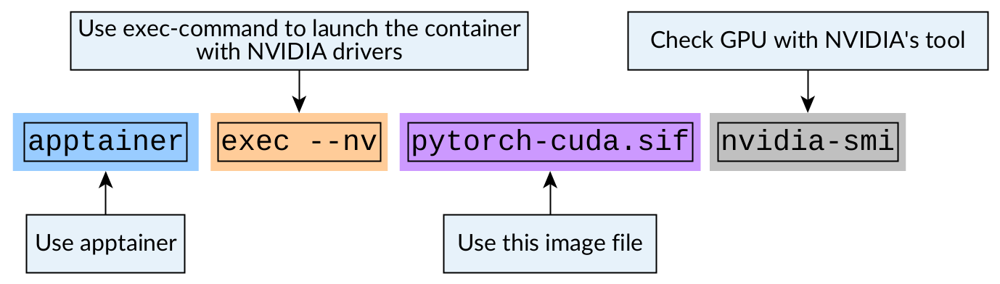
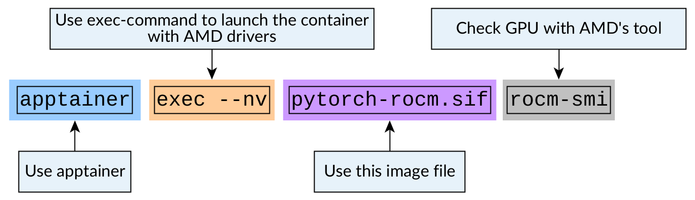

Running containers that use GPUs
================================

.. objectives::

   * Learn how you can use GPUs with containers

If your program uses GPUs, you'll need to make the GPUs visible in
the container. This is done by giving additional flag to the
apptainer command.

The container itself must have the correct GPU computing libraries
installed inside the image (CUDA toolkit for NVIDIA and ROCm for AMD).
Code inside the image needs to be installed with GPU support as well.
Apptainer will only mount the driver libraries and the GPU devices
that these toolkits need to run the code on GPUs.

Using NVIDIA's GPUs
*******************

When using NVIDIA's GPUs that use the CUDA-framework the flag is ``--nv``.

As an example, let's get a CUDA-enabled PyTorch-image:

:download:`accelerate_cuda.def </examples/accelerate_cuda.def>`:

.. literalinclude:: /examples/accelerate-cuda.def
   :language: singularity

Now when we launch the image, we can give the image GPU access with

.. code-block:: console

   $ apptainer exec --nv pytorch-cuda.sif python -c 'import torch; print(torch.cuda.is_available())'

   Figure 1: Enabling NVIDIA's GPUs in containers

.. admonition:: Expected result
   :class: dropdown

   If you run this in a system with an NVIDIA GPU, you should see the following result:

   .. code-block:: console

      $ apptainer exec --nv pytorch-cuda.sif python -c 'import torch; print(torch.cuda.is_available())'
      True

Using AMD's GPUs
****************

When using AMD's GPUs that use the ROCm-framework the flag is ``--rocm``.

As an example, let's get a ROCm-enabled PyTorch-image:

.. code-block:: console

   $ apptainer pull pytorch-rocm.sif docker://docker.io/rocm/pytorch:rocm6.1_ubuntu22.04_py3.10_pytorch_2.1.2

Now when we launch the image, we can give the image GPU access with

.. code-block:: console

   $ apptainer exec --rocm pytorch-rocm.sif python -c 'import torch; print(torch.cuda.is_available())'

   Figure 2: Enabling AMD's GPUs in containers

.. admonition:: Expected result
   :class: dropdown

   If you run this in a system with an AMD GPU, you should see the following result:

   .. code-block:: console

      $ apptainer exec --rocm pytorch-rocm.sif python -c 'import torch; print(torch.cuda.is_available())'
      True

Example container: Model training with accelerate
*************************************************

`Accelerate <https://huggingface.co/docs/accelerate/en/index>`__
is a library designed for running distributed PyTorch code.

Let's create a container that can run a simple training example
that can utilizes multiple GPUs.

Container starts from an existing container with PyTorch installed
and installs a few missing Python packages:

:download:`accelerate_cuda.def </examples/accelerate_cuda.def>`:

.. literalinclude:: /examples/accelerate_cuda.def
   :language: singularity

Submission script that launches the container looks like this:

:download:`run_accelerate_cuda.sh </examples/run_accelerate_cuda.sh>`:

.. literalinclude:: /examples/run_accelerate_cuda.sh
   :language: slurm

.. tabs::

   .. tab:: Triton (Aalto)

      To build the image:

      .. code-block:: console

         $ srun --mem=32G --cpus-per-task=4 --time=01:00:00 apptainer build accelerate_cuda.sif accelerate_cuda.def

      To run the example:

      .. code-block:: console

         $ wget https://raw.githubusercontent.com/huggingface/accelerate/refs/heads/main/examples/nlp_example.py
         $ sbatch run_accelerate_cuda.sh
         $ cat accelerate_cuda.out 
         Some weights of BertForSequenceClassification were not initialized from the model checkpoint at bert-base-cased and are newly initialized: ['classifier.bias', 'classifier.weight']
         You should probably TRAIN this model on a down-stream task to be able to use it for predictions and inference.
         You're using a BertTokenizerFast tokenizer. Please note that with a fast tokenizer, using the `__call__` method is faster than using a method to encode the text followed by a call to the `pad` method to get a padded encoding.
         epoch 0: {'accuracy': 0.7598039215686274, 'f1': 0.8032128514056225}
         epoch 1: {'accuracy': 0.8480392156862745, 'f1': 0.8931034482758621}
         epoch 2: {'accuracy': 0.8406862745098039, 'f1': 0.888507718696398}

Review of this session
**********************

.. admonition:: Key points to remember

   - Code inside the container image needs to support GPU calculations.
   - Container image should have a working CUDA / ROCm toolkit installed.
   - Use ``--nv`` / ``--rocm``-flag to mount the device drivers inside of the image.
