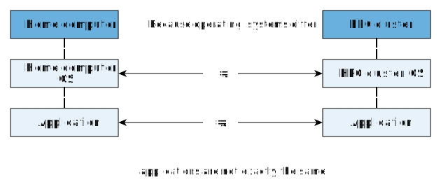
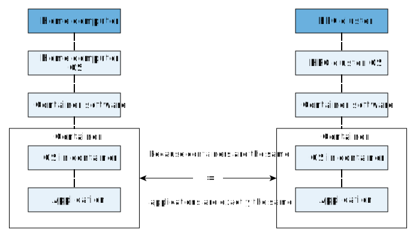

Intro about containers (on HPC)
===============================

.. objectives::

   * Understand the basic logic and terms behind containers
   * Learn about the possibilities with containers on HPC clusters

What even is a container?
-------------------------

Containers take their name from shipping containers:

.. figure:: https://upload.wikimedia.org/wikipedia/commons/3/36/Shipping_container%2C_Bellarena_-_geograph.org.uk_-_1859736.jpg

   Figure 1: A shipping container in its natural habitat

This analogue is based on the idea is that containers have a barrier
between the insides of the container and outside of the container.
This makes shipping them between ports easy.

Based on this analogue one might think that the container is just a
storage format.

Instead it is a way of running **an application in a self-contained
environment with all the tools that this specific application needs**.

More traditional container launchers like docker, podman and kubernetes
also manage containers' resource usage and various other aspects. When
using apptainer, we do not need to worry about these features.

.. admonition:: How traditional containers work

   Traditional containers use linux namespaces.

Let's consider the following case:

1. User installs and runs an application on a their home computer
2. They want to run the exact same application on their HPC cluster
3. The operating system / available software is different on the HPC cluster
4. Even if the program runs, it is necessarily not the **exact same program** as operating system has changed

With containers the user would run the exact same container on both systems:

.. admonition:: Key point

   Containers are a way of launching an application in a self-contained
   environment.

   Container can refer to:

Image sources
-------------

- Shipping container, Bellarena by Rossographer, `CC BY-SA 2.0 <https://creativecommons.org/licenses/by-sa/2.0>`__, via `Wikimedia Commons <https://commons.wikimedia.org/wiki/File:Shipping_container,_Bellarena_-_geograph.org.uk_-_1859736.jpg>`__

