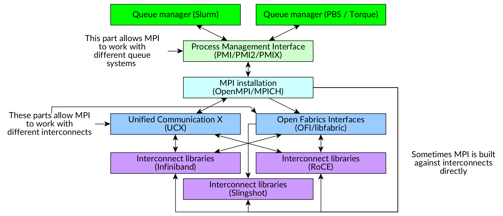

MPI programs and containers
===========================

.. objectives::

   * Learn what complications are involved with MPI containers
   * Learn how to generate a MPI container for your HPC system

What to consider when creating a container for MPI programs?
------------------------------------------------------------

Message Passing Interface (MPI) is a standardized API and a programming
paradigm where programs can use MPI directives to send messages
across thousands of processes. It is commonly used in traditional
HPC computing.

To handle the scale of the MPI programs the MPI installations
are typically tied to the high-speed interconnect available in
the computational cluster and to the queue system that the cluster
uses.

This can create the following problems when an MPI program
is containerized:

1. Launching of the MPI job can fail if the program does not
   communicate with the queue system.
2. The MPI communication performance can be bad if the program
   does not utilize the high-speed interconnects correctly.
3. The container can have portability issues when taking it to
   a different cluster with different MPI, queue system or
   interconnect.

To solve these problems we first need to know how MPI works.

How MPI works
-------------

The launch process for an MPI program works like this:

1. A reservation is done in the queue system for some number
   of MPI tasks.
2. When the reservation gets the resources, individual MPI
   programs are launched by the queue system (``srun``) or
   by an MPI launcher (``mpirun``).
3. User's MPI program calls the MPI librarires it was built
   against.
4. These libraries ask the queue system how many other MPI
   tasks there are.
5. Individual MPI tasks start running the program collectively.
   Communication between tasks is done via fast interconnects.

.. figure:: img/mpi_job_structure.png
   :width: 100%

   Figure 1: How MPI programs launch

To make this work with various different queue systems and
various different interconnects MPI installations often
utilize Process Management Interface (PMI/PMI2/PMIx) when
they connect to the queue system and Unified Communication X
when they connect to the interconnects.

   Figure 2: How MPI installations are usually constructed

How to use MPI with a container
-------------------------------

Most common way of running MPI programs in containers is
to utilize a
`hybrid model <https://apptainer.org/docs/user/main/mpi.html#hybrid-model>`__,
where the container contains the same MPI version as the host system.

When using this model the MPI launcher will call the MPI
within the container and use it to launch the application.

.. figure:: img/mpi_job_structure_hybrid.png
   :width: 100%

   Figure 3: Hybrid MPI job launch

Do note that the MPI inside the container does not necessarily
know how to utilize the fast interconnects. We'll talk about
solving this later.

Creating a simple MPI container
-------------------------------

Let's construct an example container that runs a simple
MPI benchmark from
`OSU Micro-Benchmarks <http://mvapich.cse.ohio-state.edu/benchmarks/>`__.
This benchmark suite is useful for testing whether the MPI
installation works and whether the MPI can utilize the fast
interconnect.

Because different sites have different MPI versions the definition
files differ as well. Pick a definition file for your site.

.. tabs::

   .. tab:: Triton (Aalto)

      :download:`triton-openmpi.def </examples/triton-openmpi.def>`:

      .. literalinclude:: /examples/triton-openmpi.def
         :language: singularity

      To build:

      .. code-block:: console

         srun --mem=16G --cpus-per-task=4 --time=01:00:00 apptainer build triton-openmpi.sif triton-openmpi.def

      To run (some extra parameters are needed to prevent launch errors):

      .. code-block:: console

         $ module load openmpi/4.1.6
         $ export PMIX_MCA_gds=hash
         $ export UCX_POSIX_USE_PROC_LINK=n
         $ export OMPI_MCA_orte_top_session_dir=/tmp/$USER/openmpi
         $ srun --partition=batch-milan --mem=2G --nodes=2-2 --ntasks-per-node=1 --time=00:10:00 apptainer run openmpi-triton.sif
         srun: job 3521915 queued and waiting for resources
         srun: job 3521915 has been allocated resources

         # OSU MPI Bandwidth Test v7.4
         # Datatype: MPI_CHAR.
         # Size      Bandwidth (MB/s)
         1                       3.98
         2                       8.05
         4                      15.91
         8                      32.03
         16                     64.24
         32                    125.47
         64                    245.52
         128                   469.00
         256                   877.69
         512                  1671.24
         1024                 3218.11
         2048                 5726.91
         4096                 8096.24
         8192                10266.18
         16384               11242.78
         32768               11298.70
         65536               12038.27
         131072              12196.28
         262144              12202.05
         524288              11786.58
         1048576             12258.48
         2097152             12179.43
         4194304             12199.89

   .. tab:: Puhti (CSC)

      :download:`puhti-openmpi.def <examples/puhti-openmpi.def>`:

      .. literalinclude:: /examples/puhti-openmpi.def
         :language: singularity

      To build:

      .. code-block:: console

         apptainer build puhti-openmpi.sif puhti-openmpi.def

      To run (some extra parameters are needed to prevent error messages):

      .. code-block:: console

         $ module load openmpi/4.1.4
         $ export PMIX_MCA_gds=hash
         $ srun --account=project_XXXXXXX --partition=large --mem=2G --nodes=2-2 --ntasks-per-node=1 --time=00:10:00 apptainer run puhti-openmpi.sif
         srun: job 23736111 queued and waiting for resources
         srun: job 23736111 has been allocated resources

         # OSU MPI Bandwidth Test v7.4
         # Datatype: MPI_CHAR.
         # Size      Bandwidth (MB/s)
         1                       5.17
         2                      10.47
         4                      20.89
         8                      41.63
         16                     82.00
         32                    166.40
         64                    310.73
         128                   477.56
         256                  1162.51
         512                  2250.29
         1024                 3941.94
         2048                 6174.39
         4096                 8029.47
         8192                10120.93
         16384               10632.41
         32768               10892.60
         65536               11609.92
         131072              11778.05
         262144              12015.96
         524288              11970.93
         1048576             12008.62
         2097152             12050.35
         4194304             12058.36

   .. tab:: LUMI (CSC)

      :download:`lumi-mpich.def <examples/lumi-mpich.def>`:

      .. literalinclude:: /examples/lumi-mpich.def
         :language: singularity

      Building images in not allowed on LUMI, so you need to
      build this on your own laptop or some other machine:

      .. code-block:: console

         apptainer build lumi-mpich.sif lumi-mpich.def

      Afterwards copy the image to your work directory in LUMI.

      To use the fast interconnect you need to install
      ``singularity-bindings``-module with EasyBuild:

      .. code-block:: console

         module load LUMI/23.09 EasyBuild-user
         eb singularity-bindings-system-cpeGNU-23.09-noglibc.eb -r

      To run the example:

      .. code-block:: console

         $ module load LUMI/23.09 EasyBuild-user singularity-bindings
         $ export SINGULARITY_BIND=$SINGULARITY_BIND,/usr/lib64/libnl-3.so.200
         $ srun --account=project_XXXXXXXXX --partition=dev-g --mem=2G --nodes=2-2 --ntasks-per-node=1 --time=00:10:00 singularity run lumi-mpich.sif
         srun: job 8108520 queued and waiting for resources
         srun: job 8108520 has been allocated resources

         # OSU MPI Bandwidth Test v7.4
         # Datatype: MPI_CHAR.
         # Size      Bandwidth (MB/s)
         1                       2.03
         2                       4.09
         4                       8.17
         8                      16.23
         16                     32.64
         32                     65.57
         64                    130.49
         128                   260.55
         256                   492.28
         512                   983.37
         1024                 1965.42
         2048                 3924.00
         4096                 7823.52
         8192                14349.54
         16384               17373.03
         32768               18896.90
         65536               20906.04
         131072              21811.68
         262144              22228.01
         524288              22430.80
         1048576             22537.82
         2097152             22592.50
         4194304             22619.96

   .. tab:: Sigma2 (Norway)

      Follow `these instructions <https://documentation.sigma2.no/code_development/guides/container_mpi.html>`__.

Utilizing the fast interconnects
--------------------------------

In order to get the fast interconnects to work with the hybrid model
one can either:

1. Install the interconnect drivers into the image and build the MPI to
   use them. This is the normal Hybrid approach described in Figure 3.
2. Mount cluster's MPI and other network libraries into the image and use
   them instead of the container's MPI while running the MPI program.
   This is described in Figure 4.

   Figure 4: Container with bound system MPI and network libraries

Below are explanations on how the interconnect libraries were provided.

.. tabs::

   .. tab:: Triton (Aalto)

      The interconnect support was provided by the ``libucx-dev``-package that
      provides Infiniband drivers.

      :download:`triton-openmpi.def <examples/triton-openmpi.def>`, line 15:

      .. literalinclude:: /examples/triton-openmpi.def
         :# Copy example from imagelanguage: singularity
         :lines: 15

      The OpenMPI installation was then configured to use these drivers:

      :download:`triton-openmpi.def <examples/triton-openmpi.def>`, line 26:

      .. literalinclude:: /examples/triton-openmpi.def
         :language: singularity
         :lines: 26

   .. tab:: Puhti (CSC)

      The interconnect support is provided by installing drivers from
      Mellanox's Infiniband driver repository:

      :download:`puhti-openmpi.def <examples/puhti-openmpi.def>`, lines 27-38:

      .. literalinclude:: /examples/puhti-openmpi.def
         :language: singularity
         :lines: 27-38

   .. tab:: LUMI (CSC)

      Module ``singularity-bindings`` mounts the system MPI and network drivers
      into the container:

      .. code-block:: console

         $ module load LUMI/23.09 EasyBuild-user singularity-bindings
         $ export SINGULARITY_BIND=$SINGULARITY_BIND,/usr/lib64/libnl-3.so.200
         $ echo $SINGULARITY_BIND
         /opt/cray,/var/spool,/etc/host.conf,/etc/hosts,/etc/nsswitch.conf,/etc/resolv.conf,/etc/ssl/openssl.cnf,/run/cxi,/usr/lib64/libbrotlicommon.so.1,/usr/lib64/libbrotlidec.so.1,/usr/lib64/libcrypto.so.1.1,/usr/lib64/libcurl.so.4,/usr/lib64/libcxi.so.1,/usr/lib64/libgssapi_krb5.so.2,/usr/lib64/libidn2.so.0,/usr/lib64/libjansson.so.4,/usr/lib64/libjitterentropy.so.3,/usr/lib64/libjson-c.so.3,/usr/lib64/libk5crypto.so.3,/usr/lib64/libkeyutils.so.1,/usr/lib64/libkrb5.so.3,/usr/lib64/libkrb5support.so.0,/usr/lib64/liblber-2.4.so.2,/usr/lib64/libldap_r-2.4.so.2,/usr/lib64/libnghttp2.so.14,/usr/lib64/libpcre.so.1,/usr/lib64/libpsl.so.5,/usr/lib64/libsasl2.so.3,/usr/lib64/libssh.so.4,/usr/lib64/libssl.so.1.1,/usr/lib64/libunistring.so.2,/usr/lib64/libzstd.so.1,/lib64/libselinux.so.1,,/usr/lib64/libnl-3.so.200
         $ echo $SINGULARITYENV_LD_LIBRARY_PATH
         /opt/cray/pe/mpich/8.1.27/ofi/gnu/9.1/lib-abi-mpich:/opt/cray/pe/lib64:/opt/cray/libfabric/1.15.2.0/lib64:/opt/cray/xpmem/default/lib64:/usr/lib64:/opt/cray/pe/gcc-libs

   .. tab:: Sigma2 (Norway)

      Interconnect support is not explicitly installed.

ABI compatibility in MPI
------------------------

Different MPI installations do not have necessarily have
application binary interface (ABI) compatibility. This means
that software built with certain MPI installation does not
necessarily run with another MPI installation.

Quite often MPI programs are built with the same version
of MPI that will be used to run the program. However, in
containerized applications the runtime MPI version might change
if an outside MPI is bound into the container.

This can work as there is some ABI compatibility
within an MPI family (OpenMPI, MPICH). For more info, see
`OpenMPI's page on version compatibility <https://docs.open-mpi.org/en/v5.0.x/version-numbering.html>`__
and
`MPICH's ABI Compatibility Initiative <https://www.mpich.org/abi/>`__.

There are also projects like
`E4S Container Launcher <https://e4s-cl.readthedocs.io/en/latest/index.html>`__
and
`WI4MPI (Wrapper Interface for MPI) <https://github.com/cea-hpc/wi4mpi>`__
that aim to bypass this problem by creating a wrapper interfaces
that the program in the container can be built against. This
wrapper can then use different MPI implementations during
runtime.

Example on portability: LAMMPS
------------------------------

LAMMPS is a classical molecular dynamics simulation code with a focus
on materials modeling.

Let's build a container with LAMMPS in it:

.. literalinclude:: /examples/lammps-openmpi.def
   :language: singularity

Let's also create a submission script that runs a LAMMPS example
where an indent will pushes against a material:

.. literalinclude:: /examples/run_lammps_indent.sh
   :language: singularity

Now this exact same container can be run in both Triton / Puhti that have
OpenMPI installed because both clusters use Slurm and InfiniBand
interconnects.

.. tabs::

   .. tab:: Triton (Aalto)

      .. code-block:: console

         $ export PMIX_MCA_gds=hash
         $ export UCX_POSIX_USE_PROC_LINK=n
         $ export OMPI_MCA_orte_top_session_dir=/tmp/$USER/openmpi
         $ sbatch run_lammps_indent.sh
         $ tail -n 27 lammps_indent.out
         Loop time of 0.752293 on 4 procs for 30000 steps with 420 atoms

         Performance: 10336396.152 tau/day, 39878.072 timesteps/s, 16.749 Matom-step/s
         99.6% CPU use with 4 MPI tasks x 1 OpenMP threads

         MPI task timing breakdown:
         Section |  min time  |  avg time  |  max time  |%varavg| %total
         ---------------------------------------------------------------
         Pair    | 0.31927    | 0.37377    | 0.42578    |   7.5 | 49.68
         Neigh   | 0.016316   | 0.020162   | 0.023961   |   2.3 |  2.68
         Comm    | 0.19882    | 0.25882    | 0.31814    |  10.2 | 34.40
         Output  | 0.00033215 | 0.00038609 | 0.00054361 |   0.0 |  0.05
         Modify  | 0.044981   | 0.049941   | 0.054024   |   1.7 |  6.64
         Other   |            | 0.04921    |            |       |  6.54

         Nlocal:            105 ave         112 max          98 min
         Histogram: 1 0 1 0 0 0 0 1 0 1
         Nghost:           92.5 ave          96 max          89 min
         Histogram: 1 0 1 0 0 0 0 1 0 1
         Neighs:         892.25 ave        1003 max         788 min
         Histogram: 2 0 0 0 0 0 0 0 1 1

         Total # of neighbors = 3569
         Ave neighs/atom = 8.497619
         Neighbor list builds = 634
         Dangerous builds = 0
         Total wall time: 0:00:01

   .. tab:: Puhti (CSC)

      .. code-block:: console

         $ export PMIX_MCA_gds=hash
         $ sbatch --account=project_XXXXXXX --partition=large run_lammps_indent.sh
         $ tail -n 27 lammps_indent.out
         Loop time of 0.527178 on 4 procs for 30000 steps with 420 atoms

         Performance: 14750222.558 tau/day, 56906.723 timesteps/s, 23.901 Matom-step/s
         99.7% CPU use with 4 MPI tasks x 1 OpenMP threads

         MPI task timing breakdown:
         Section |  min time  |  avg time  |  max time  |%varavg| %total
         ---------------------------------------------------------------
         Pair    | 0.22956    | 0.26147    | 0.28984    |   5.5 | 49.60
         Neigh   | 0.012471   | 0.015646   | 0.018613   |   2.3 |  2.97
         Comm    | 0.13816    | 0.17729    | 0.2192     |   9.3 | 33.63
         Output  | 0.00023943 | 0.00024399 | 0.00025267 |   0.0 |  0.05
         Modify  | 0.03212    | 0.035031   | 0.037378   |   1.2 |  6.65
         Other   |            | 0.0375     |            |       |  7.11

         Nlocal:            105 ave         112 max          98 min
         Histogram: 1 0 1 0 0 0 0 1 0 1
         Nghost:           92.5 ave          96 max          89 min
         Histogram: 1 0 1 0 0 0 0 1 0 1
         Neighs:         892.25 ave        1003 max         788 min
         Histogram: 2 0 0 0 0 0 0 0 1 1

         Total # of neighbors = 3569
         Ave neighs/atom = 8.497619
         Neighbor list builds = 634
         Dangerous builds = 0
         Total wall time: 0:00:01

Review of this session
----------------------

.. admonition:: Key points to remember

   - MPI version should match the version installed to the cluster
   - Cluster MPI module should be loaded for maximum compatibility with job launching
   - Care must be taken to make certain that the container utilizes
     fast interconnects
