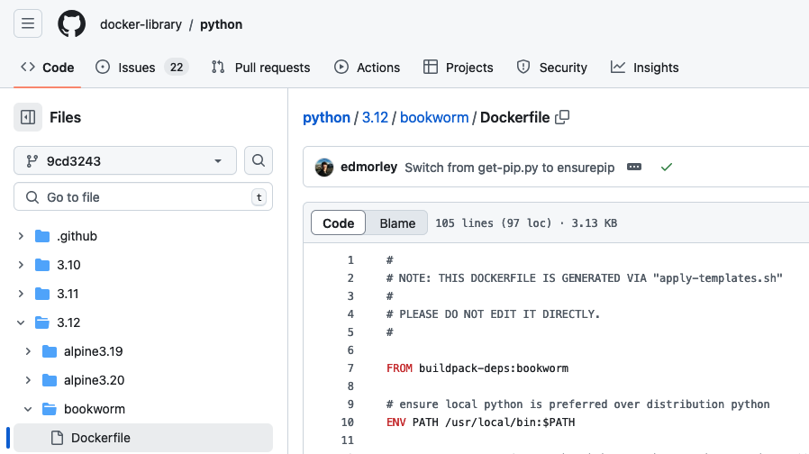

Sharing reproducible containers
==================================

.. objectives::

- Objective 1 - Know of some key best practices for creating reproducible containers
- Objective 2 - Know of some common version control services

Reuse
----------

(work in progress - Maiken working on this part)

- Use available base containers
- Add your customisation on top of that

As we have learned, building a container means that you pack the OS and all the applications you need into it. We have also learned that typically we don't do everything from scratch, we build upon base containers.

An :doc:`example <building_images>` was using an official python image for our python container: 

.. code-block:: singularity

   Bootstrap: docker
   From: python:latest

   %files
       summation.py /opt

   %runscript
       echo "Got arguments: $*"
       exec python /opt/summation.py "$@"

   %post
       pip install numpy

Here we saw that we use the python base image (for instance from `<https://hub.docker.com/_/python>`_ and in addtion we install some more software: numpy (and we bind mount a custom file into the image). 

Building upon base-images is used extensively: The python image is not just python, it is again based on an another image (``FROM buildpack-deps:bookworm``) , which itself is based on another image and so on. 

We can trail though the Dockerfiles hopefully linked to via the image registrery page and we find the following dependency:

Image dependency

.. code-block::

  Our python image
   --> From: python:latest
     --> FROM: buildpack-deps:bookworm
       --> FROM buildpack-deps:bookworm-scm
         --> FROM buildpack-deps:bookworm-curl
           --> FROM debian:bookworm

.. admonition:: Take-away message

  Check if there is a suitable official base image for the applications you need, and build upon that. 

Popular base images
+++++++++++++++++++++++++

There probably exists a base image for your need, almost whatever it is. If you google e.g. "best docker containers" you will find useful lists of popular ones. Here is a customised selection of such a list - with some images we find very useful: 

- `Alpine <https://hub.docker.com/_/alpine>`_ (slim Linux OS)

- `BusyBox <https://hub.docker.com/_/busybox>`_ (slim Linux OS with many common Linux utilities)

- `Nginx <https://hub.docker.com/_/nginx>`_ (web server)

- `Ubuntu <https://hub.docker.com/_/ubuntu>`_ (Linux OS)

- `Python <https://hub.docker.com/_/python>`_

- `PostGreSQL <https://hub.docker.com/_/postgres>`_ (database)

- `Node <https://hub.docker.com/_/node>`_ (web development)

- `MySQL <https://hub.docker.com/_/mysql>`_ (database) 
    
- `Jupyter datascience-notebook <https://hub.docker.com/r/jupyter/datascience-notebook>`_

Once you have found a suitable base image, you must think about what version to chose. You will see that each image has a selection of different versions, so which should you chose? More on that next. 

Be specific
-----------------

(work in progress)

- Use specific software version of everything
- Show file with/without software versions and explain behaviour in both cases

One of the main objectives of using images is that the users gets exactly what expect, and everything should just work as the container is self contained. But remember that upon pulling your container from some central repository, and that images are based on other images again, and in addition can contain additional software. All this will be fetched freshly. If all or some of the dependent images or softwares do not have any version specified, the latest version will be fetched. And now you can get into problems! Maybe the latest version of your base image is not compatible with the other software the image has included. Or which you are including. This can spoil the party massively! 

Be as specific as you can! Always specify the software version you use. 

So taking our python image as an example, you should do this - specify base image version, and specify numpy version: 

.. code-block:: singularity

   Bootstrap: docker
   From: python:3.12.7-bookworm

   %files
       summation.py /opt

   %runscript
       echo "Got arguments: $*"
       exec python /opt/summation.py "$@"

   %post
       pip install numpy==1.26.0

Separate concerns
----------------------

(work in progress)
- Only include things that are related to the computation and are general
- Input-data is typically not general
- User specific configuration 
 
Use version control and public registries
----------------------------------------------

- GitLab/GitHub for definition files
- Public registry for pre-built images
- Link the repo to the public registry

## Exercise

(work in progress)
