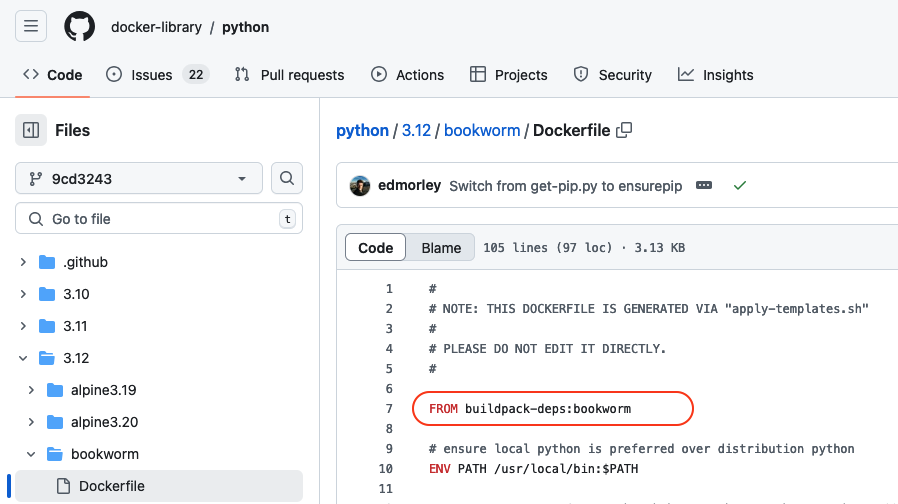

Sharing reproducible containers
===============================

.. objectives::

  - Know about **good practices** for creating reproducible containers
  - Know about some **popular services** to share container definition files and images

Reuse
-----

As we have learned, building a container means that you pack the OS and all
the applications you need into a file. We have also learned that typically we
don't do everything from scratch, we **build upon base containers**.

This means that when building containers we try to:

- Use available base containers
- Add customisation on top of that

An :doc:`example <building_images>` was using an official python image for our python container:

.. code-block:: singularity

   Bootstrap: docker
   From: python:latest

   %files
       summation.py /opt

   %runscript
       echo "Got arguments: $*"
       exec python /opt/summation.py "$@"

   %post
       pip install numpy

Here we use the python base image (for instance from
`<https://hub.docker.com/_/python>`_) and in addition we install some more
software: numpy (and we bind mount a custom file into the image).

Building upon base-images is used extensively: The python image is not just python, it is again based on an another image (``FROM buildpack-deps:bookworm``) , which itself is based on another image, and so on ...

We can trail though the Dockerfiles hopefully linked to via the image registry
page and we find the following dependency:

Image dependency

.. code-block::

  Our python image
   --> From: python:latest
     --> FROM: buildpack-deps:bookworm
       --> FROM buildpack-deps:bookworm-scm
         --> FROM buildpack-deps:bookworm-curl
           --> FROM debian:bookworm

.. admonition:: Take-away message

  Check if there is a suitable official base image for the applications you need, and build upon that.

Popular base images
+++++++++++++++++++

There probably exists a base image for your need, almost whatever it is. If you
web-search e.g. "best docker containers" you will find useful lists of popular
ones. Here is a customised selection of such a list - with some images we find
very useful:

- `Alpine <https://hub.docker.com/_/alpine>`_ (slim Linux OS)

- `BusyBox <https://hub.docker.com/_/busybox>`_ (slim Linux OS with many common Linux utilities)

- `Nginx <https://hub.docker.com/_/nginx>`_ (web server)

- `Ubuntu <https://hub.docker.com/_/ubuntu>`_ (Linux OS)

- `Python <https://hub.docker.com/_/python>`_

- `PostGreSQL <https://hub.docker.com/_/postgres>`_ (database)

- `Node <https://hub.docker.com/_/node>`_ (web development)

- `MySQL <https://hub.docker.com/_/mysql>`_ (database)

- `Jupyter datascience-notebook <https://hub.docker.com/r/jupyter/datascience-notebook>`_

Once you have found a suitable base image, you must think about what version to
chose. You will see that each image has a selection of different versions, so
which should you chose? We will explore this in the next section.

Be specific
-----------

(work in progress)

- Use specific software version of everything
- Show file with/without software versions and explain behaviour in both cases

One of the main objectives of using images is that the users gets exactly what
they expect, and everything should just work. The container is after all
self-contained!

But remember that upon pulling your container (from some central repository),
the image is fetched "freshly". If all or some of the dependent layers do not
have any version specified, the latest version will be fetched. And now you can
get into problems! Maybe the latest version of your base image is not
compatible with the other software the image has included. Or which you are
including. This can spoil the party massively!

.. admonition:: Take-away message

  Be as specific as you can! Always specify software version.

So taking our python image as an example, specify base image version, and specify numpy version:

.. code-block:: singularity

   Bootstrap: docker
   From: python:3.12.7-bookworm

   %files
       summation.py /opt

   %runscript
       echo "Got arguments: $*"
       exec python /opt/summation.py "$@"

   %post
       pip install numpy==1.26.0

Separate concerns
-----------------

(work in progress)

- Only include things that are related to the computation and are general
- Input-data is typically not general
- User specific configuration

Use version control and public registries
-----------------------------------------

(work in progress - Radovan working on this part)

- GitLab/GitHub for definition files
- Public registry for pre-built images
- Link the repo to the public registry

Exercises
---------

.. exercise:: Exercise Sharing-1: Time-travel with containers

   Imagine the following situation: A researcher has written and published their research code which
   requires a number of libraries and system dependencies. They ran their code
   on a Linux computer (Ubuntu). One very nice thing they did was to publish
   also a container image with all dependencies included, as well as the
   definition file (below) to create the container image.

   Now we travel 3 years into the future and want to reuse their work and adapt
   it for our data. The container registry where they uploaded the container
   image however no longer exists. But luckily (!) we still have the definition
   file (below). From this we should be able to create a new container image.

   - Can you anticipate problems using the definition file here 3 years after its
     creation? Which possible problems can you point out?
   - Discuss possible take-aways for creating more reusable containers.

   .. tabs::

      .. tab:: Python project using virtual environment

         .. literalinclude:: sharing/bad-example-python.def
            :language: singularity
            :linenos:

         .. solution::

            - Line 2: "ubuntu:latest" will mean something different 3 years in future.
            - Lines 11-12: The compiler gcc and the library libgomp1 will have evolved.
            - Line 30: The container uses requirements.txt to build the virtual environment but we don't see
              here what libraries the code depends on.
            - Line 33: Data is copied in from the hard disk of the person who created it. Hopefully we can find the data somewhere.
            - Line 35: The library fancylib has been built outside the container and copied in but we don't see here how it was done.
            - Python version will be different then and hopefully the code still runs then.
            - Singularity/Apptainer will have also evolved by then. Hopefully this definition file then still works.
            - No help text.
            - No contact address to ask more questions about this file.
            - (Can you find more? Please contribute more points.)

            .. literalinclude:: sharing/bad-example-python.def
               :language: singularity
               :linenos:
               :emphasize-lines: 2, 11-12, 30, 33, 35

      .. tab:: C++ project

         This definition files has potential problems 3 years later. Further
         down on this page we show a better and real version.

         .. literalinclude:: sharing/bad-example-cxx.def
            :language: singularity
            :linenos:

         .. solution::

            - Line 2: "ubuntu:latest" will mean something different 3 years in future.
            - Lines 9: The libraries will have evolved.
            - Line 11: We clone a Git repository recursively and that repository might evolve until we build the container image the next time.
              here what libraries the code depends on.
            - Line 18: The library fancylib has been built outside the container and copied in but we don't see here how it was done.
            - Singularity/Apptainer will have also evolved by then. Hopefully this definition file then still works.
            - No help text.
            - No contact address to ask more questions about this file.
            - (Can you find more? Please contribute more points.)

            .. literalinclude:: sharing/bad-example-cxx.def
               :language: singularity
               :linenos:
               :emphasize-lines: 2, 9, 11, 18

.. exercise:: Exercise Sharing-2: Building a container on GitHub

   You can build a container on GitHub (using GitHub Actions) or GitLab (using
   GitLab CI) and host the image it on GitHub/GitLab. This has the following
   advantages:
    - You don't need to host it yourself.
    - But the image stays close to its sources and is not on a different service.
    - Anybody can inspect the recipe and how it was built.
    - Every time you make a change to the recipe, it builds a new image.

   If you want to try this out:
    - Take `this repository <https://github.com/bast/html2pdf>`_ as starting point and inspiration.
    - Don't focus too much on what this container does, but rather `how it is built <https://github.com/bast/html2pdf/tree/main/.github/workflows>`_.
    - To build a new version, one needs to send a pull request which updates
      the file ``VERSION`` and modifies the definition file.
    - Using this approach, try to build a very simple container definition
      directly on GitHub where the goal is to have both the definition file
      and the image file in the same place.
